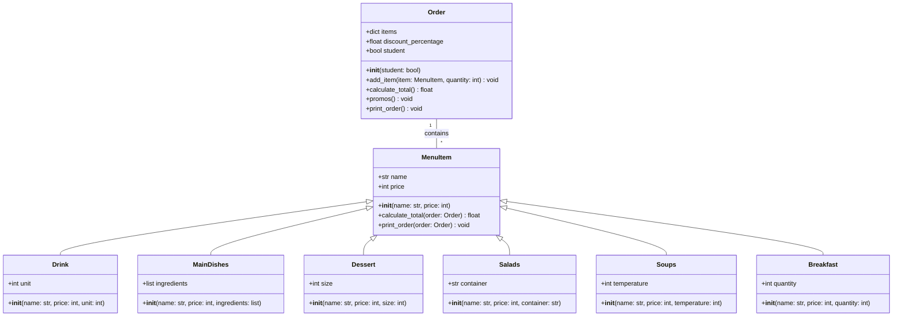

# Reto #03

### Ejercicio de Geometría ###

Este código define varias clases geométricas en Python:

1. **Clase `Point`**: 
   - Representa un punto en el plano con coordenadas `x` e `y`.
   - Incluye métodos para mover el punto, restablecer sus coordenadas y calcular la distancia a otro punto.

2. **Clase `Line`**: 
   - Representa una línea definida por dos puntos.
   - Calcula su longitud, pendiente y discretiza la línea en puntos igualmente espaciados.

3. **Clase `Rectangle`**: 
   - Representa un rectángulo, que puede definirse mediante diferentes métodos: 
     - Esquina inferior-izquierda y dimensiones.
     - Centro y dimensiones.
     - Dos esquinas opuestas.
     - Cuatro líneas.
   - Calcula el área, el perímetro y verifica la intersección con puntos o líneas.

4. **Clase `Square`**: 
   - Hereda de `Rectangle` y garantiza que el ancho y la altura sean iguales, lo que asegura que sea un cuadrado.

El código incluye ejemplos de uso de estas clases, como la creación de puntos, líneas, rectángulos y cuadrados, y la realización de cálculos relacionados, como la discretización de líneas en puntos, el cálculo del área y la comprobación de interferencias entre geometrías.

**Nota**: Al finalizar el código, se incluye una imagen que muestra la prueba real de los métodos del rectángulo.

```python
import math  
# Clase Point (Punto) que representa un punto en el plano cartesiano.
class Point:
    def __init__(self, x=0, y=0) -> None:
        """
        Inicializa un punto con las coordenadas x e y. Si no se especifican, 
        se asignan valores por defecto (0,0).
        """

        self.x = x
        self.y = y

    def __str__(self) -> str:
        """Devuelve una cadena que describe el objeto 'Point'."""
        return "Se ha creado el objeto punto"

    def move(self, new_x, new_y):
        """Permite mover el punto a nuevas coordenadas (new_x, new_y)."""
        self.x = new_x
        self.y = new_y

    def reset(self):
        """Reinicia las coordenadas del punto a (0, 0)."""
        self.x = 0
        self.y = 0

    def compute_distance(self, point: "Point") -> float:
        """
        Calcula la distancia entre el punto actual y otro punto utilizando
        la fórmula de distancia euclidiana.
        """
        return (((self.x - point.x) ** 2) + ((self.y - point.y) ** 2)) ** 0.5

    # Descripción de la clase como una definición general
    definition: str = "Entidad geométrica abstracta que representa" \
                "una ubicación en un espacio."


# Clase Line (Línea) que representa una línea definida por dos puntos.
class Line:
    def __init__(self, point_start: 'Point', point_end: 'Point') -> None:
        """Inicializa una línea con dos puntos de inicio y fin."""
        self.point_start = point_start
        self.point_end = point_end
        self.length = point_start.compute_distance(point_end)  # Calcula la longitud de la línea
        self.dx = point_end.x - point_start.x  # Diferencia en el eje x
        self.dy = point_end.y - point_start.y  # Diferencia en el eje y
        self.slope = (self.dy) / (self.dx) if self.dx != 0 else None  # Calcula la pendiente (si no es vertical)
        self.slope_radians = round(math.atan2(self.dy, self.dx), 2)  # Calcula la pendiente en radianes
        self.slope_degrees = f"{math.degrees(self.slope_radians):.2f}°"  # Convierte la pendiente a grados
        self.discretize_line_matrix: list = []  # Lista para almacenar puntos discretizados de la línea

    def calculate_length(self) -> float:
        """Devuelve la longitud de la línea."""
        return self.length

    def calculate_slope(self) -> float:
        """Devuelve la pendiente de la línea."""
        return self.slope

    # Método para determinar si la línea cruza el eje X
    def calculate_horizontal_cross(self) -> bool:
        return True if (self.point_end.y * self.point_start.y) < 0 else False

    # Método para determinar si la línea cruza el eje Y
    def calculate_vertical_cross(self) -> bool:
        return True if (self.point_end.x * self.point_start.x) < 0 else False

    # Discretiza la línea en varios puntos y los guarda en una lista
    def discretize_line(self, number_of_points: int) -> list:
        self.discretize_line_matrix = []
        increment_x = self.dx / (number_of_points - 1)  # Incremento en el eje X
        increment_y = self.dy / (number_of_points - 1)  # Incremento en el eje Y
        for i in range(number_of_points):
            self.discretize_line_matrix.append(
                Point(self.point_start.x + increment_x * i,
                      self.point_start.y + increment_y * i)
            )
        return self.discretize_line_matrix


# Clase Rectangle (Rectángulo) que representa un rectángulo con diferentes métodos de inicialización.
class Rectangle:
    def __init__(self, method: int = 1, *args) -> None:
        """Inicializa un rectángulo según el método seleccionado."""
        match method:
            case 1:  # Método 1: Esquina inferior-izquierda, ancho y altura
                self.bottom_left_corner = args[0]
                self.width: Point = args[1]
                self.height = args[2]
                self.center = Point(
                    self.bottom_left_corner.x + self.width / 2,
                    self.bottom_left_corner.y + self.height / 2,
                )
            case 2:  # Método 2: Centro, ancho y altura
                self.center: Point = args[0]
                self.width = args[1]
                self.height = args[2]
            case 3:  # Método 3: Esquinas inferior-izquierda y superior-derecha
                self.bottom_left_corner: Point = args[0]
                self.upper_right_corner: Point = args[1]
                self.width = (
                    self.upper_right_corner.x - self.bottom_left_corner.x
                    )
                self.height = (
                    self.upper_right_corner.y - self.bottom_left_corner.y
                    )
                self.center = Point(
                    self.bottom_left_corner.x + self.width / 2,
                    self.bottom_left_corner.y + self.height / 2,
                )
            case 4:  # Método 4: Líneas como lados del rectángulo
                self.bottom: Line = args[0]
                self.left: Line = args[1]
                self.upper: Line = args[2]
                self.right: Line = args[3]
                if not (
                    self.bottom.point_start.x == self.left.point_start.x
                    and self.left.point_end.y == self.upper.point_start.y
                    and self.upper.point_end.x == self.right.point_start.x
                    and self.right.point_start.y == self.bottom.point_start.y
                ):
                    print(
                        "Los puntos no coinciden, por lo tanto no se puede"
                        " crear un rectángulo"
                    )
                    return None
                self.width = self.right.length
                self.height = self.upper.length
                self.center = Point(
                    self.left.point_start.x + self.width / 2,
                    self.bottom.point_start.y + self.height / 2,
                )
            case _:  # Método por defecto
                print("No se ha seleccionado un método válido")

    def compute_area(self) -> float:
        """Calcula y devuelve el área del rectángulo."""
        return self.height * self.width

    def compute_perimeter(self) -> float:
        """Calcula y devuelve el perímetro del rectángulo."""
        return 2 * (self.height + self.width)

    def calculate_interference_point(self, point: 'Point') -> bool:
        """Determina si un punto está dentro del rectángulo."""
        return (
            (self.center.x - self.width / 2 <= point.x
            <= self.center.x + self.width / 2) and
            (self.center.y - self.height / 2 <= point.y
            <= self.center.y + self.height / 2)
        )

    def calculate_interference_line(self, line: 'Line') -> bool:
        """Determina si una línea cruza el rectángulo."""
        start_interference = self.calculate_interference_point(line.point_start)
        end_interference = self.calculate_interference_point(line.point_end)
        return start_interference != end_interference


# Clase Square (Cuadrado) que hereda de Rectangle, representando un cuadrado.
class Square(Rectangle):
    def __init__(self, method: int = 0, *args) -> None:
        """Inicializa un cuadrado y valida que sus lados sean iguales."""
        super().__init__(method, *args)
        if self.width != self.height:
            print(
                "El ancho y el alto no son iguales, por lo tanto"
                " no se puede crear un cuadrado",
                self.width,
                self.height
            )


# Creación de puntos y líneas de prueba.
point1 = Point(x=1, y=0)
point2 = Point(x=4, y=2)
point3 = Point(x=2.5, y=1)
point4 = Point(x=-3, y=0)
point5 = Point(x=2, y=1)
point6 = Point(x=2, y=4)
point7 = Point(x=4, y=0)
point8 = Point(x=1, y=2)
point9 = Point(x=1, y=3)
point10 = Point(x=4, y=3)

# Creación de líneas de prueba.
line1 = Line(point4, point5)
line2 = Line(point4, point6)
line3 = Line(point1, point7)
line4 = Line(point1, point8)
line5 = Line(point8, point2)
line6 = Line(point7, point2)
line7 = Line(point1, point9)
line8 = Line(point9, point10)
line9 = Line(point7, point10)

# Pruebas de los métodos de Line
print(line2.slope_radians)  # Muestra la pendiente en radianes
print(line2.slope_degrees)  # Muestra la pendiente en grados
line2.discretize_line(5)  # Discretiza la línea en 5 puntos
for idx, point in enumerate(line2.discretize_line_matrix, start=1):
    print(f"[[Punto {idx}], [{point.x:.2f}], [{point.y:.2f}]]")

# Creación de rectángulos y cuadrados usando diferentes métodos
# Metodo 1: Esquina inferior-izquierda, ancho y altura
rectangle1 = Rectangle(1, point1, 3, 2)
square1 = Square(1, point1, 3, 3)

# Metodo 2: Centro, ancho y altura
rectangle2 = Rectangle(2, point1, 3, 2)
square2 = Square(2, point1, 3, 3)

# Metodo 3: Esquinas inferior-izquierda y superior-derecha
rectangle3 = Rectangle(3, point1, point2)
square3 = Square(3, point1, point2)

#Metodo 4: Líneas como lados del rectángulo y cuadrado
rectangle3 = Rectangle(4, line3, line4, line5, line6)
square3 = Square(4, line3, line7, line8, line9)

# Pruebas de los métodos de Rectangle
print(rectangle3.compute_area())  # Calcula el área del rectángulo
print(rectangle3.compute_perimeter())  # Calcula el perímetro del rectángulo
# Verifica si un punto está dentro del rectángulo
print(rectangle3.calculate_interference_point(point=point3)) 
print(rectangle3.calculate_interference_point(point=point4)) 
# Verifica si una línea cruza el rectángulo
print(rectangle3.calculate_interference_line(line1))  
print(rectangle3.calculate_interference_line(line2))  
```


---


#
# Sistema de Gestión de Órdenes en Restaurante


### Clases Principales

1. **MenuItem**:  
   Representa un artículo del menú (como una bebida o un plato) con un nombre (`name`) y un precio (`price`).
   - Métodos:
     - `calculate_total`: Calcula el total de una orden aplicando los descuentos.
     - `print_order`: Imprime los detalles de la orden, incluidos los artículos, los precios y el total con el descuento aplicado.

2. **Order**:  
   Representa una orden realizada por un cliente.  
   - Atributos:
     - `items`: Un diccionario que guarda los artículos y sus cantidades.
     - `discount_percentage`: El porcentaje de descuento aplicado.
     - `student`: Un valor booleano que indica si el cliente es estudiante.
   - Métodos:
     - `add_item`: Añade un artículo a la orden, multiplicando su precio por la cantidad.
     - `calculate_total`: Calcula el total de la orden aplicando los descuentos.
     - `promos`: Aplica los descuentos según reglas predefinidas (descuento por cantidad de artículos, descuento para estudiantes y un descuento aleatorio).
     - `print_order`: Imprime la orden con los artículos y el total con el descuento aplicado.

3. **Subclases de MenuItem**:
   - **Drink**: Representa una bebida, con un atributo adicional `unit` que define la cantidad en mililitros.
   - **MainDishes**: Representa un plato principal, con un atributo `ingredients` que lista los ingredientes del plato.
   - **Dessert**: Representa un postre, con un atributo `size` que define el tamaño del postre.
   - **Salads**: Representa una ensalada, con un atributo `container` que define el tipo de recipiente.
   - **Soups**: Representa una sopa, con un atributo `temperature` que indica si la sopa es caliente o fría.
   - **Breakfast**: Representa un desayuno, con un atributo `quantity` que define la cantidad de unidades.

```python
import random


class MenuItem:
    """Representa un artículo del menú con un nombre y un precio."""

    def __init__(self, name: str, price: int) -> None:
        """Inicializa el artículo del menú con nombre y precio."""
        self.name = name
        self.price = price

    def calculate_total(self, order: 'Order') -> float:
        """Calcula el total de una orden aplicando descuento."""
        total = sum(order.items.values())
        total -= total * order.discount_percentage
        return total

    def print_order(self, order: 'Order') -> None:
        """Imprime los detalles de la orden y el total con descuento."""
        for item, price in order.items.items():
            print(f"{item.name} - {price}")
        print(f"Descuento: {order.discount_percentage * 100}%")
        print(f"Total: ${order.calculate_total():,} pesos")


class Order:
    """Representa una orden realizada por un cliente."""

    def __init__(self, student: bool = False) -> None:
        """Inicializa la orden con un descuento y una lista de artículos."""
        self.items: dict = {}  # Diccionario de artículos con cantidades
        self.discount_percentage: float = 0  # Descuento inicial
        self.student = student  # Flag para indicar si es estudiante

    def add_item(self, item: MenuItem, quantity: int) -> None:
        """Añade un artículo a la orden multiplicado por la cantidad."""
        self.items[item] = quantity * item.price

    def calculate_total(self) -> float:
        """Calcula el total de la orden aplicando el descuento."""
        total = sum(self.items.values())
        total -= total * self.discount_percentage  # Aplica descuento
        return total

    def promos(self) -> None:
        """Aplica promociones y descuentos según reglas predefinidas."""
        self.discount_percentage = 0  # Restablece el descuento

        # Descuento por cantidad de artículos
        if len(self.items) >= 6:  # 6 platos o más 10% de descuento
            self.discount_percentage += 0.1

        # Descuento adicional para estudiantes
        if self.student:  # Descuento del 20% para estudiantes
            self.discount_percentage += 0.2

        # Descuento aleatorio del 100%
        if random.random() < 0.1:  # 10% de probabilidad
            self.discount_percentage = 1

    def print_order(self) -> None:
        """Imprime la orden y el total con descuento aplicado."""
        for item, price in self.items.items():
            print(f"{item.name} - {price}")
        print(f"Descuento: {self.discount_percentage * 100}%")
        print(f"Total: ${self.calculate_total():,} pesos")


class Drink(MenuItem):
    """Clase para representar una bebida del menú."""

    def __init__(self, name: str, price: int, unit: int) -> None:
        """Inicializa una bebida con su nombre, precio y unidad de medida(ml)."""
        super().__init__(name, price)
        self.unit = unit


class MainDishes(MenuItem):
    """Clase para representar un plato principal del menú."""

    def __init__(self, name: str, price: int, ingredients: list) -> None:
        """Inicializa un plato principal con su nombre, precio e ingredientes."""
        super().__init__(name, price)
        self.ingredients: list = ingredients


class Dessert(MenuItem):
    """Clase para representar un postre del menú."""

    def __init__(self, name: str, price: int, size: int) -> None:
        """Inicializa un postre con su nombre, precio y tamaño."""
        super().__init__(name, price)
        self.size = size


class Salads(MenuItem):
    """Clase para representar una ensalada del menú."""

    def __init__(self, name: str, price: int, container: str) -> None:
        """Inicializa una ensalada con su nombre, precio y tipo de recipiente."""
        super().__init__(name, price)
        self.container = container


class Soups(MenuItem):
    """Clase para representar una sopa del menú."""

    def __init__(self, name: str, price: int, temperature: int) -> None:
        """Inicializa una sopa con su nombre, precio y temperatura."""
        super().__init__(name, price)
        self.temperature = temperature  # 1: caliente, 2: frío


class Breakfast(MenuItem):
    """Clase para representar un desayuno del menú."""

    def __init__(self, name: str, price: int, quantity: int) -> None:
        """Inicializa un desayuno con su nombre, precio y cantidad."""
        super().__init__(name, price)
        self.quantity = quantity


# Bebidas
cafe = Drink("Café", 2000, 200)  # 200 ml
jugo_lulo = Drink("Jugo de Lulo", 2500, 250)  # 250 ml
agua_panela = Drink("Agua de panela", 1500, 300)  # 300 ml

# Platos principales
arepas = MainDishes("Arepa con queso", 8000, ["arepa", "queso"])
bandeja_paisa = MainDishes(
    "Bandeja Paisa",
    25000,
    ["arroz", "frijoles", "huevo", "carne", "chicharrón", "aguacate"],
)
sancocho = MainDishes(
    "Sancocho de gallina", 15000, ["gallina", "yuca", "papas", "plátano"]
)
ajiaco = MainDishes("Ajiaco", 18000, ["pollo", "papas", "mazorca", "guasca"])
empanadas = MainDishes("Empanadas", 3500, ["harina de maíz", "carne", "papas"])
bandeja_pescado = MainDishes(
    "Bandeja De Pescado",
    22000,
    ["arroz", "pescado frito", "patacones", "ensalada", "aguacate"],
)
tamal = MainDishes(
    "Tamales", 7000, ["masa de maíz", "carne", "pollo", "papa", "zanahoria"]
)

# Postres
arroz_con_leche = Dessert("Arroz con Leche", 3500, 200)  # 200 g
tres_leches = Dessert("Pastel Tres Leches", 5000, 180)  # 180 g
torta_de_guanabana = Dessert("Torta de Guanábana", 4500, 150)  # 150 g

# Ensaladas
ensalada_mixta = Salads("Ensalada Mixta", 4000, "tazón")
ensalada_de_pasta = Salads("Ensalada de Pasta", 5000, "plato")

# Sopas
sopa_de_lentejas = Soups("Sopa de Lentejas", 6000, 1)  # Caliente
sopa_de_carne = Soups("Sopa de Carne", 8000, 1)  # Caliente
sopa_de_vegetales = Soups("Sopa de Vegetales", 7000, 1)  # Caliente

# Desayunos
arepas_con_huevo = Breakfast("Arepas con Huevo", 5000, 2)  # 2 unidades
calentado = Breakfast("Calentado", 7000, 1)  # 1 porción
empanadas_con_aji = Breakfast("Empanadas con Aji", 4500, 3)  # 3 unidades


# Funcionamiento de las órdenes
print("---Orden 1---")
cliente = Order(student=True)
cliente.add_item(arepas, 2)
cliente.add_item(cafe, 1)
cliente.add_item(bandeja_paisa, 1)
cliente.add_item(arroz_con_leche, 1)

cliente.promos()
cliente.print_order()

print("\n\n---Orden 2---")
cliente2 = Order()
cliente2.add_item(ajiaco, 1)
cliente2.add_item(jugo_lulo, 1)
cliente2.add_item(sancocho, 1)
cliente2.add_item(tres_leches, 1)
cliente2.add_item(arepas_con_huevo, 5)
cliente2.add_item(empanadas, 2)
cliente2.add_item(torta_de_guanabana, 1)
cliente2.add_item(agua_panela, 1)

cliente2.promos()
cliente2.print_order()

```

- Diagrama De clases


