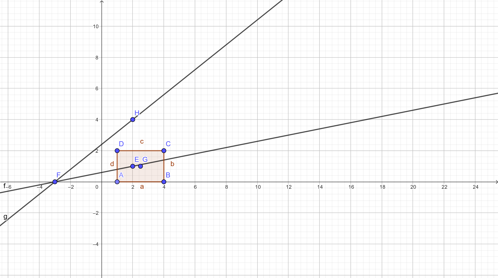

# Reto_03
# Reto #03

Este código define varias clases geométricas en Python:

1. **Clase `Point`**: 
   - Representa un punto en el plano con coordenadas `x` e `y`.
   - Incluye métodos para mover el punto, restablecer sus coordenadas y calcular la distancia a otro punto.

2. **Clase `Line`**: 
   - Representa una línea definida por dos puntos.
   - Calcula su longitud, pendiente y discretiza la línea en puntos igualmente espaciados.

3. **Clase `Rectangle`**: 
   - Representa un rectángulo, que puede definirse mediante diferentes métodos: 
     - Esquina inferior-izquierda y dimensiones.
     - Centro y dimensiones.
     - Dos esquinas opuestas.
     - Cuatro líneas.
   - Calcula el área, el perímetro y verifica la intersección con puntos o líneas.

4. **Clase `Square`**: 
   - Hereda de `Rectangle` y garantiza que el ancho y la altura sean iguales, lo que asegura que sea un cuadrado.

El código incluye ejemplos de uso de estas clases, como la creación de puntos, líneas, rectángulos y cuadrados, y la realización de cálculos relacionados, como la discretización de líneas en puntos, el cálculo del área y la comprobación de interferencias entre geometrías.

**Nota**:Al finalizar el código, se incluye una imagen que muestra la prueba real de los métodos del rectángulo.

```python
import math

class Point:
    def __init__(self, x=0, y=0) -> None:
        self.x = x
        self.y = y

    def __str__(self) -> str:
        return "Se ha creado el objeto punto"

    def move(self, new_x, new_y):
        self.x = new_x
        self.y = new_y

    def reset(self):
        self.x = 0
        self.y = 0

    def compute_distance(self, point: "Point") -> float:
        return (((self.x - point.x) ** 2) + ((self.y - point.y) ** 2)) ** 0.5

    definition: str = "Entidad geométrica abstracta que representa una ubicación en un espacio."


class Line:
    def __init__(self, point_start: 'Point', point_end: 'Point') -> None:
        self.point_start = point_start
        self.point_end = point_end
        self.length = point_start.compute_distance(point_end)
        self.dx = point_end.x - point_start.x
        self.dy = point_end.y - point_start.y
        self.slope = (self.dy) / (self.dx) if self.dx != 0 else None
        self.slope_radians = round(math.atan2(self.dy, self.dx), 2)
        self.slope_degrees = f"{math.degrees(self.slope_radians):.2f}°"
        self.discretize_line_matrix: list = []

    def calculate_length(self) -> float:
        return self.length

    def calculate_slope(self) -> float:
        return self.slope

    # Se calcula si la línea cruza el eje X por medio de la multiplicación
    # de los puntos en Y. Si el resultado es negativo, la línea cruza el eje X.
    def calculate_horizontal_cross(self) -> bool:
        return True if (self.point_end.y * self.point_start.y) < 0 else False

    # Se calcula si la línea cruza el eje Y por medio de la multiplicación
    # de los puntos en X. Si el resultado es negativo, la línea cruza el eje Y.
    def calculate_vertical_cross(self) -> bool:
        return True if (self.point_end.x * self.point_start.x) < 0 else False

    def discretize_line(self, number_of_points: int) -> list:
        self.discretize_line_matrix = []
        increment_x = self.dx / (number_of_points - 1)
        increment_y = self.dy / (number_of_points - 1)
        for i in range(number_of_points):
            self.discretize_line_matrix.append(
                Point(self.point_start.x + increment_x * i,
                      self.point_start.y + increment_y * i)
            )
        return self.discretize_line_matrix


class Rectangle:
    def __init__(self, method: int = 1, *args) -> None:
        match method:
            case 1:  # Esquina inferior-izquierda (Point), ancho y altura
                self.bottom_left_corner = args[0]
                self.width: Point = args[1]
                self.height = args[2]
                self.center = Point(
                    self.bottom_left_corner.x + self.width / 2,
                    self.bottom_left_corner.y + self.height / 2,
                )
            case 2:  # Centro (Point), ancho y altura
                self.center: Point = args[0]
                self.width = args[1]
                self.height = args[2]
            case 3:  # Esquinas inferior-izquierda y superior-derecha (Puntos)
                self.bottom_left_corner: Point = args[0]
                self.upper_right_corner: Point = args[1]
                self.width = (
                    self.upper_right_corner.x - self.bottom_left_corner.x
                    )
                self.height = (
                    self.upper_right_corner.y - self.bottom_left_corner.y
                    )
                self.center = Point(
                    self.bottom_left_corner.x + self.width / 2,
                    self.bottom_left_corner.y + self.height / 2,
                )
            case 4:  # Inferior, izquierda, superior y derecha (líneas)
                self.bottom: Line = args[0]
                self.left: Line = args[1]
                self.upper: Line = args[2]
                self.right: Line = args[3]
                if not (
                    self.bottom.point_start.x == self.left.point_start.x
                    and self.left.point_end.y == self.upper.point_start.y
                    and self.upper.point_end.x == self.right.point_start.x
                    and self.right.point_start.y == self.bottom.point_start.y
                ):
                    print(
                        "Los puntos no coinciden, por lo tanto no se puede"
                        " crear un rectángulo"
                    )
                    return None
                self.width = self.right.length
                self.height = self.upper.length
                self.center = Point(
                    self.left.point_start.x + self.width / 2,
                    self.bottom.point_start.y + self.height / 2,
                )
            case _:  # Default
                print("No se ha seleccionado un método válido")

    def compute_area(self) -> float:
        return self.height * self.width

    def compute_perimeter(self) -> float:
        return 2 * (self.height + self.width)

    def calculate_interference_point(self, point: 'Point') -> bool:
        return (
            (self.center.x - self.width / 2 <= point.x
            <= self.center.x + self.width / 2) and
            (self.center.y - self.height / 2 <= point.y
            <= self.center.y + self.height / 2)
        )

    def calculate_interference_line(self, line: 'Line') -> bool:
        start_interference = self.calculate_interference_point(line.point_start)
        end_interference = self.calculate_interference_point(line.point_end)
        return start_interference != end_interference


class Square(Rectangle):
    def __init__(self, method: int = 0, *args) -> None:
        super().__init__(method, *args)
        if self.width != self.height:
            print(
                "El ancho y el alto no son iguales, por lo tanto"
                "no se puede crear un cuadrado",
                self.width,
                self.height
            )


# Asignación de Puntos
point1 = Point(x=1, y=0)
point2 = Point(x=4, y=2)
point3 = Point(x=2.5, y=1)
point4 = Point(x=-3, y=0)
point5 = Point(x=2, y=1)
point6 = Point(x=2, y=4)
point7 = Point(x=4, y=0)
point8 = Point(x=1, y=2)
point9 = Point(x=1, y=3)
point10 = Point(x=4, y=3)

# Asignación de Líneas
line1 = Line(point4, point5)
line2 = Line(point4, point6)
line3 = Line(point1, point7)
line4 = Line(point1, point8)
line5 = Line(point8, point2)
line6 = Line(point7, point2)
line7 = Line(point1, point9)
line8 = Line(point9, point10)
line9 = Line(point7, point10)

# Pruebas de métodos
print(line2.slope_radians)
print(line2.slope_degrees)
line2.discretize_line(5)
for idx, point in enumerate(line2.discretize_line_matrix, start=1):
    print(f"[[Punto {idx}], [{point.x:.2f}], [{point.y:.2f}]]")

# Asignación de Rectángulos y Cuadrados

# Método 1
rectangle1 = Rectangle(1, point1, 3, 2)
square1 = Square(1, point1, 3, 3)

# Método 2
rectangle2 = Rectangle(2, point1, 3, 2)
square2 = Square(2, point1, 3, 3)

# Método 3
rectangle3 = Rectangle(3, point1, point2)
# Se usa para probar el error de que no se puede crear un cuadrado
square3 = Square(3, point1, point2)

# Método 4
rectangle3 = Rectangle(4, line3, line4, line5, line6)
square3 = Square(4, line3, line7, line8, line9)

# Pruebas de métodos
print(rectangle3.compute_area())
print(rectangle3.compute_perimeter())
print(rectangle3.calculate_interference_point(point=point3))
print(rectangle3.calculate_interference_point(point=point4))
print(rectangle3.calculate_interference_line(line1))
print(rectangle3.calculate_interference_line(line2))
```


---



